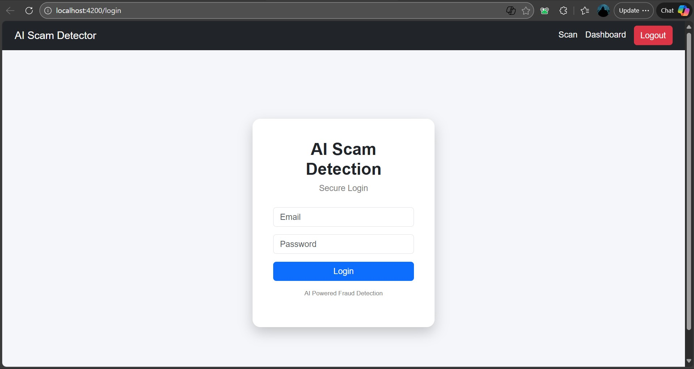
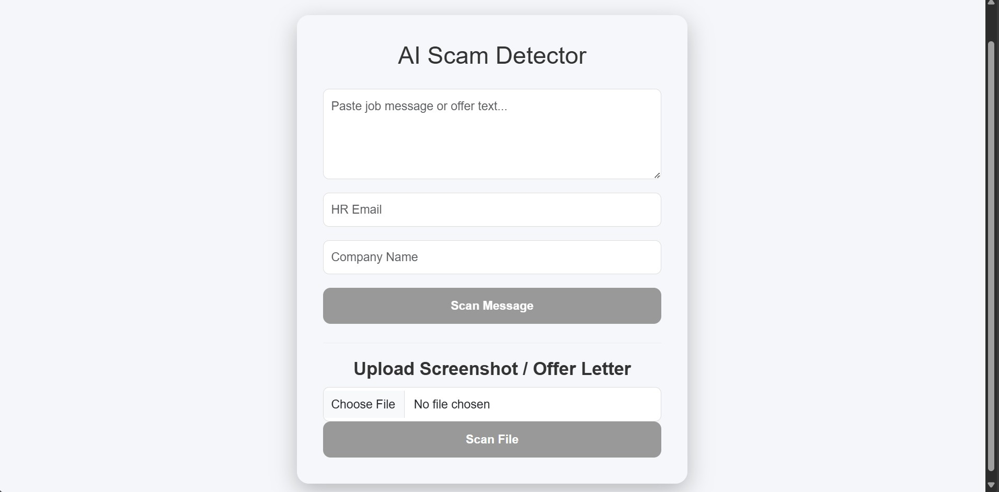
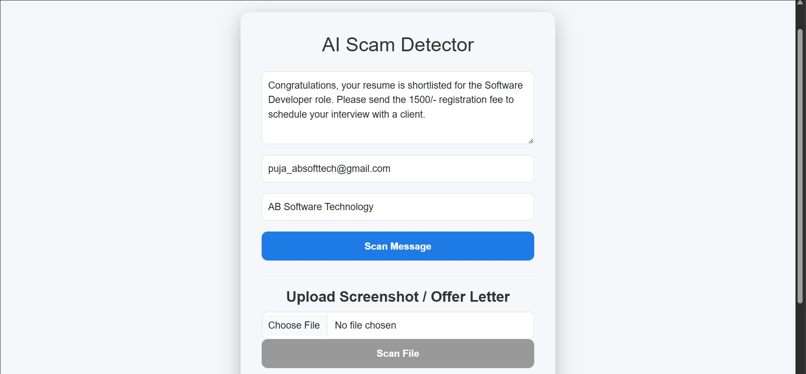
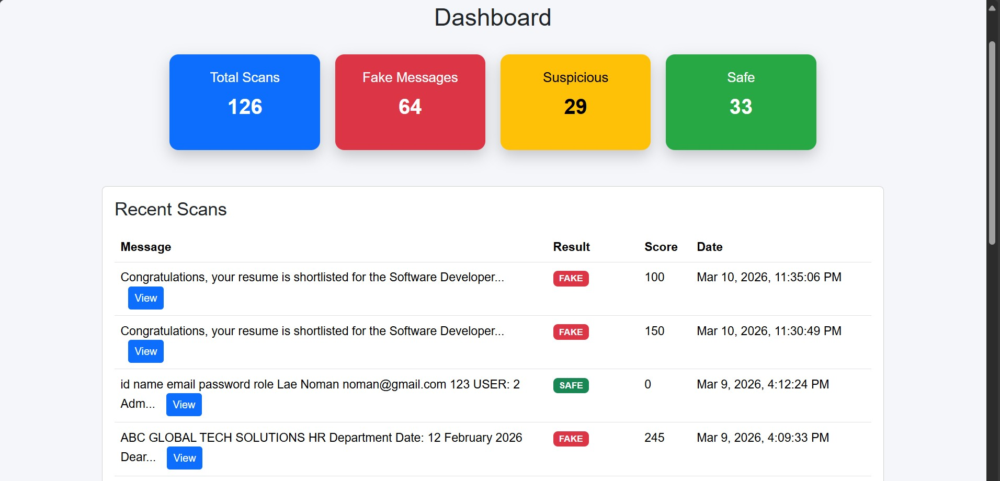

# AI Job Scam Detector

AI powered system that analyzes job offers and detects potential scams using rule-based fraud detection and email domain verification.

---

## Live Demo

Coming Soon

---

## Features

- AI based job scam detection
- Email domain verification
- Company verification
- Screenshot scanning using OCR
- PDF offer letter analysis
- Risk scoring system
- Admin analytics dashboard
- Scan history tracking
- JWT based authentication

---

## Tech Stack

### Frontend
- Angular
- Bootstrap
- TypeScript

### Backend
- Spring Boot
- REST APIs
- JWT Authentication

### Database
- MySQL

### AI Engine
- Custom Fraud Detection Engine

### OCR
- Tesseract OCR

---

## System Architecture

# AI Job Scam Detector

AI powered system that analyzes job offers and detects potential scams using rule-based fraud detection and email domain verification.

---

## Live Demo

Coming Soon

---

## Features

- AI based job scam detection
- Email domain verification
- Company verification
- Screenshot scanning using OCR
- PDF offer letter analysis
- Risk scoring system
- Admin analytics dashboard
- Scan history tracking
- JWT based authentication

---

## Tech Stack

### Frontend
- Angular
- Bootstrap
- TypeScript

### Backend
- Spring Boot
- REST APIs
- JWT Authentication

### Database
- MySQL

### AI Engine
- Custom Fraud Detection Engine

### OCR
- Tesseract OCR

---

## System Architecture
Angular Frontend
↓
Spring Boot REST API
↓
MySQL Database

---

## Screenshots

### Login Page

### Scan Page

### Result

### Dashboard

---

## Project Structure

AI-Job-Scam-Detector
│
├── backend
│ ├── controllers
│ ├── services
│ ├── repositories
│ ├── entities
│
├── frontend
│ ├── components
│ ├── services
│
└── README.md

---

## How to Run the Project

### Backend

mvn spring-boot:run

Backend runs on

http://localhost:8080

### Frontend

ng serve

Frontend runs on

http://localhost:4200

---

## Example Scan Result

Result: SUSPICIOUS
Risk Score: 35
Reason: Email domain does not match company domain

---

## Future Improvements

- Machine Learning based scam detection
- Company domain API verification
- Browser extension for job scam detection
- AI explanation engine

---

## Author

Noman Ali  
Java Full Stack Developer
